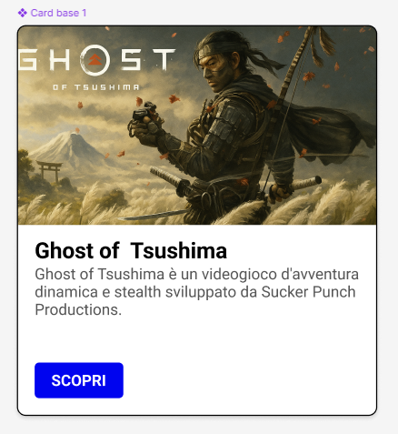

# Progetto Card Figma: Ghost of Tsushima

Questo progetto dimostra la creazione di una "card" in Figma, seguendo i principi dell'**Atomic Design** e le linee guida del **Material Design**, come illustrato nelle slide fornite. L'obiettivo era progettare una card visivamente pulita e coerente, pronta per essere riutilizzata.

## Obiettivo del Progetto

L'obiettivo principale era imparare a creare una card passo-passo in Figma che includesse un'immagine, un titolo, una descrizione e un bottone. Il tutto è stato realizzato applicando la metodologia dell'Atomic Design e le linee guida del Material Design, concentrandosi sulla progettazione visiva senza prototipazione o animazioni.

## Metodologia: Atomic Design

L'**Atomic Design** è una metodologia ideata da Brad Frost per costruire interfacce utente in modo modulare e gerarchico, ispirandosi alla chimica.

* **Atomi**: I componenti più piccoli e fondamentali. Nel nostro caso, l'immagine, il titolo, la descrizione e il bottone "SCOPRI" sono stati trattati come atomi.
* **Molecole**: Gruppi di atomi che lavorano insieme come un'unità. La card stessa è considerata una "molecola", composta dai vari atomi (immagine, titolo, descrizione, pulsante).
* **Organismi, Template e Pagine**: Livelli più complessi che non sono stati il focus di questo progetto.

Questo approccio permette di riutilizzare i componenti e mantenere coerenza, facilitando le modifiche future (es. cambiare lo stile di un bottone si rifletterà su tutte le card che lo utilizzano).

## Linee Guida Material Design Applicate

Per garantire un aspetto professionale e coerente, sono state seguite le **Material Design guidelines** di Google per le card.

* **Gerarchia del Contenuto**: L'immagine è posizionata in evidenza (in alto), seguita dal titolo (breve e in evidenza), poi la descrizione (testo più piccolo) e infine il bottone di azione.
* **Emphasis Visivo**: Sono state utilizzate dimensioni e stili di testo differenti per titolo (più grande e in grassetto) e descrizione (più piccola e regolare) per enfatizzare la gerarchia delle informazioni.
* **Spacing (Spaziatura)**: È stato adottato un sistema di 8dp (punti) come incrementi base per misure e spaziature, usando multipli di 8px per margini e padding. Ad esempio, circa 16px di margine interno ai bordi della card e 8px-16px tra gli elementi verticalmente.
* **Dimensioni e Layout**: La card ha una larghezza standard (es. ~320px) e un'altezza variabile per adattarsi al contenuto, evitando di "stipare" troppo testo.
* **Stile della Card**: La card presenta angoli leggermente arrotondati (~8px di raggio) e una leggera ombra esterna per dare un senso di profondità (`offset Y 2`, `blur 4`, `opacità 15%`).
* **Bottoni**: Sebbene il tutorial abbia utilizzato un bottone con sfondo pieno per dimostrazione, le linee guida del Material Design suggeriscono di preferire "text button" (solo testo, senza sfondo pieno) sulle card per mantenere il focus sul contenuto. Nel nostro esempio, per semplicità tecnica in Figma, è stato creato un bottone standard con sfondo blu e testo bianco per contrasto.

## Costruzione della Card in Figma (Passaggi Chiave)

1. **Creazione del Frame della Card**: Un frame principale (es. "Card Base") è stato creato con uno sfondo chiaro, angoli arrotondati (8px) e una leggera ombra esterna.
2. **Inserimento dell'Immagine**: Un rettangolo è stato disegnato all'interno del frame, agganciato al margine superiore, riempito con un'immagine e impostato su "Fill".
3. **Aggiunta del Titolo**: Un campo di testo per il titolo (es. "Ghost of Tsushima") è stato posizionato sotto l'immagine, con un font leggibile, dimensione maggiore (es. 20px) e stile Bold.Il testo è allineato a sinistra con un margine di 16px dal bordo sinistro e 16px sotto l'immagine.
4. **Aggiunta della Descrizione**: Un nuovo campo di testo per la descrizione è stato inserito sotto il titolo, con una dimensione più piccola (es. 14px o 16px) e stile Regular. Il colore è leggermente più chiaro del titolo per indicare minore importanza. La spaziatura verticale tra titolo e descrizione è di circa 8px-12px.
5. **Creazione del Bottone di Azione**: Un rettangolo per il bottone (es. 80px x 32px) è stato disegnato, con angoli arrotondati (4px) e un colore di accento (blu nell'immagine di esempio). Al suo interno è stato aggiunto il testo "SCOPRI" (maiuscolo), centrato verticalmente e orizzontalmente. Il bottone raggruppato è stato posizionato nell'area di contenuto in basso, con un padding adeguato.

Questo progetto serve come esempio pratico per creare componenti UI in Figma in modo professionale, combinando principi di design consolidati con funzionalità avanzate dello strumento.